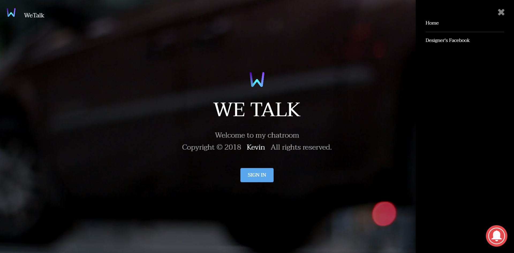
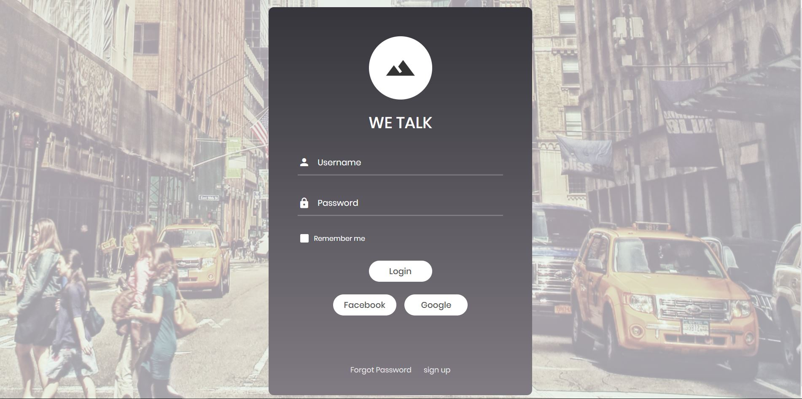
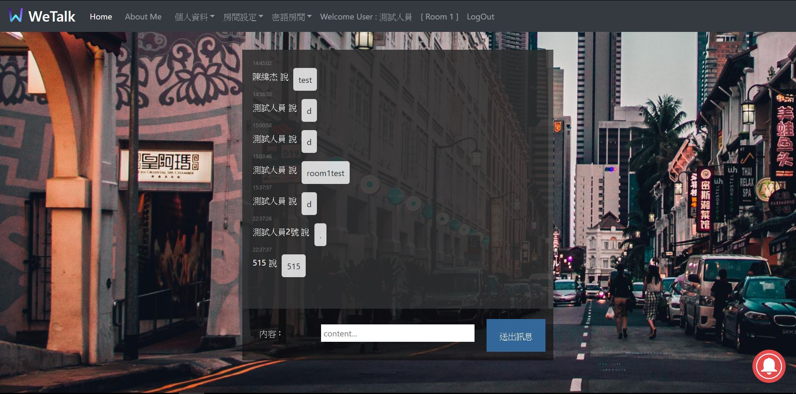
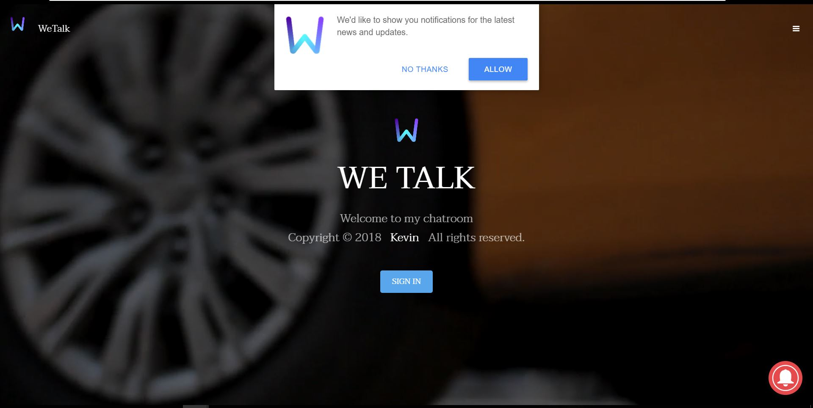
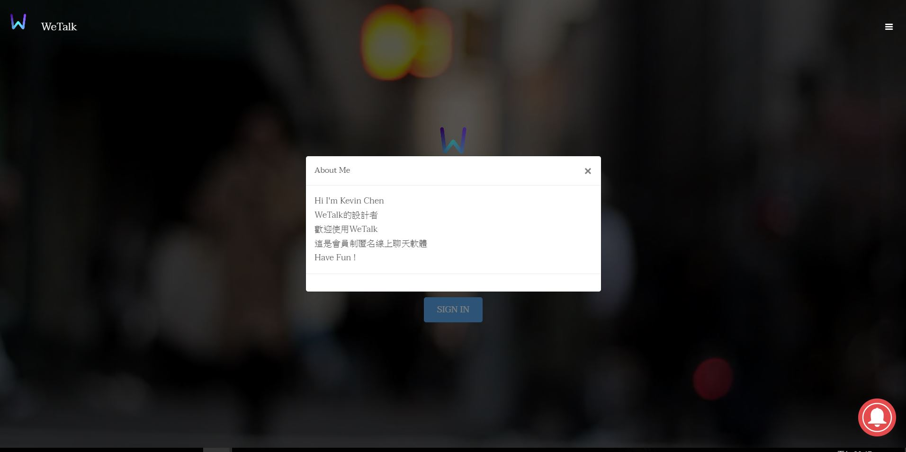

# Software Studio 2018 Spring Midterm Project
## Notice
* Replace all [xxxx] to your answer

## Topic
* Chat room
* Key functions (add/delete)
    1. chat
    2. load message history
    3. chat with new user 
* Other functions (add/delete)
    1. 可以自己切換公眾房間
    2. 可以自己創立密語房間(透過密碼才能進入)
    3. setting account(修改暱稱)
    4. 修改密碼
    5. 建立帳號

## Basic Components
|Component|Score|Y/N|
|:-:|:-:|:-:|
|Membership Mechanism|20%|Y|
|GitLab Page|5%|Y|
|Database|15%|Y|
|RWD|15%|Y|
|Topic Key Function|15%|Y|

## Advanced Components
|Component|Score|Y/N|
|:-:|:-:|:-:|
|Third-Party Sign In|2.5%|Y|
|Chrome Notification|5%|Y|
|Use CSS Animation|2.5%|Y|
|Security Report|5%|Y|
|Other functions|1~10%|Y|

## Website Detail Description
----------------------------------
畫面首頁(背景是影片但在此用圖片顯示) 
</img> 
 

登入畫面 
</img> 
 

聊天畫面 
</img> 
 

------------------------------------------------
一. 首頁 
    1.右下角有訂閱鈴鐺也有google通知 
    </img> 
     
    2.可以展開navbar 
    </img> 
     
    3.有設計者FB連結跟關於這個網站還有回到首頁
     
    4.點擊中間kevin會有彈出框 
    </img> 
     

二. 登入介面 
    1.登入介面功能介紹 
    </img> 
     
    (1) 一般Email password 登入 
    (2) Google登入 
    (3) Facebook登入 
    (4) 忘記密碼修改 
    (5) Sign up 

三. 聊天介面 
    1.聊天介面功能介紹 
    </img> 
     
    (1) Home 回到首頁 
    (2) About me (連結到我的FB) 
    (3) 個人資料(修改個人暱稱) 
    (4) 房間設定(可以選擇公眾房間) 
    (5) 密語房間(可以建立專屬密語的房間以及輸入密語進入)) 
    (6) Welcome user (可以知道目前的使用者) 
    (7) LogOut 登出 
    

----------------------------------------

## Security Report (Optional)

1.  首先是使用firebase Authentication 
    若沒有登入會員是無權使用網頁的所有功能 
    能夠增加網頁的安全性不會讓匿名者使用 

2.  另外則是網頁是採取https 
    SSL 的全名是 Secure Sockets Layer，即安全通訊端層，簡而言之，這是一種標準的技術，用於保持網際網路連線安全以及防止在兩個系統之間發送的所有敏感資料被罪犯讀取及修改任何傳輸的資訊，包括潛在的個人詳細資料。兩個系統可以是伺服器與用戶端 (例如購物網站與瀏覽器)，或者伺服器至伺服器 (例如，含有個人身份資訊或含有薪資資訊的應用程式)。 

    這樣做是為了確保使用者與網站、或兩個系統之間傳輸的任何資料保持無法被讀取的狀態。此技術可使用加密演算法以混淆輸送中的資料，防止駭客在資料透過連線發送時讀取資料。此資訊可能是任何敏感或個人資訊，包括信用卡號與其他財務資訊、姓名與地址。 
    HTTPS (Hyper Text Transfer Protocol Secure，超級文字傳輸協議安全) 會在網站受到 SSL 憑證保護時在網址中出現。該憑證的詳細資料包括發行機構與網站擁有人的企業名稱，可以透過按一下瀏覽器列上的鎖定標記進行檢視。
 
3.  所以當網頁是以https開頭，代表這個網站的安全性是足夠的